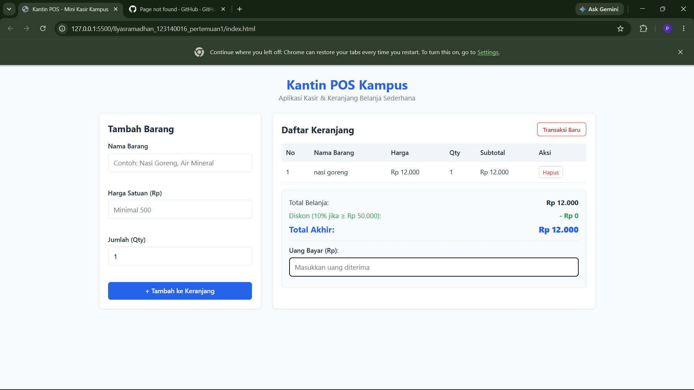
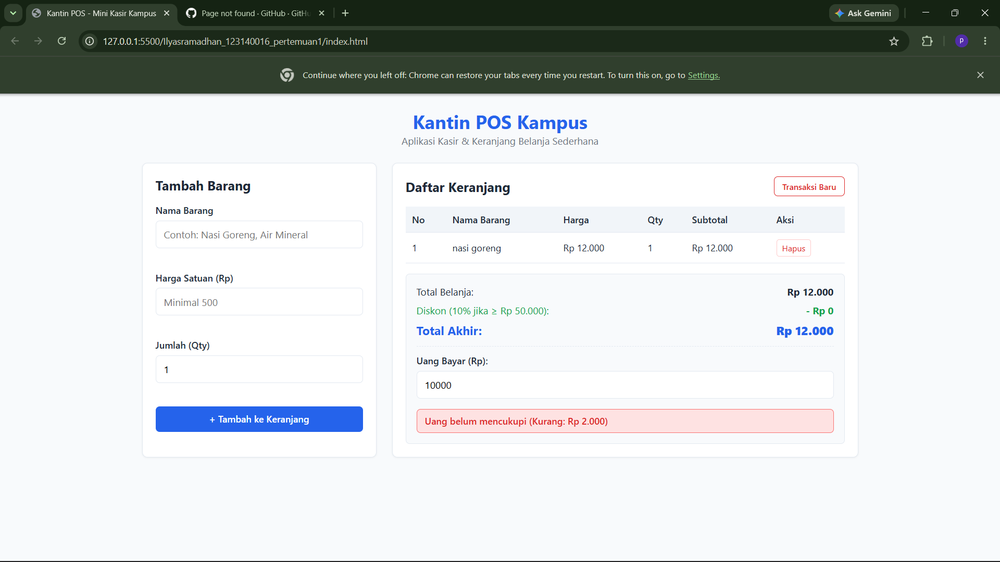
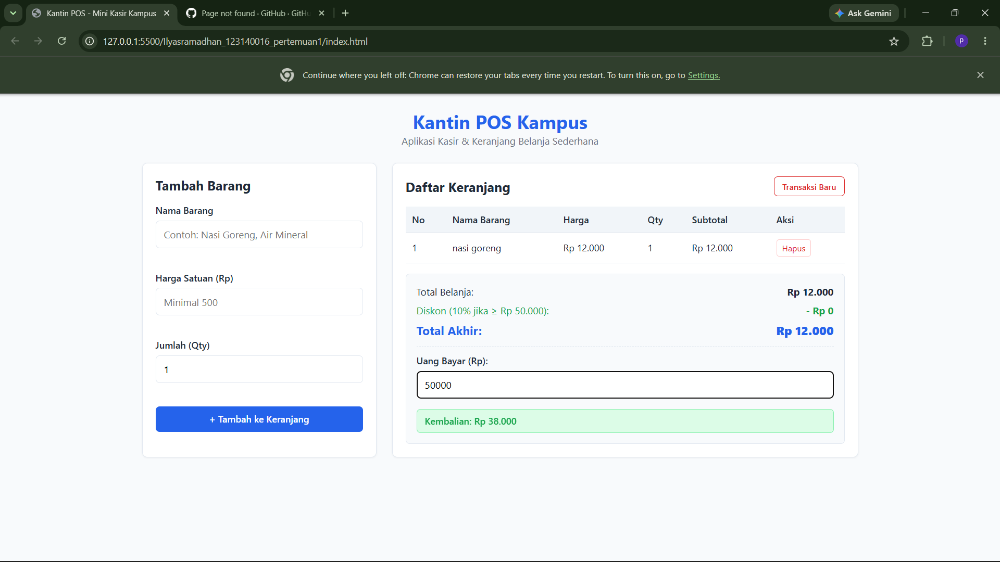

# Tugas Praktikum Pemrograman Web - Pertemuan 1
## Aplikasi Kasir & Keranjang Belanja Sederhana (Mini POS)

---

### Identitas Mahasiswa
- **Nama Lengkap:** Ilyas Ramadhan
- **NIM:** 123140016
- **Kelas Praktikum:** [Isi RA atau RB]

---

### Deskripsi Aplikasi
Aplikasi **Mini POS Kantin Kampus** adalah aplikasi berbasis web yang dirancang untuk membantu kasir kantin atau toko kampus dalam mencatat transaksi pembelian secara akurat dan efisien. Aplikasi ini mengintegrasikan validasi input sisi klien, perhitungan aritmatika otomatis (subtotal, total belanja, diskon progresif, dan kalkulator uang kembalian), serta penyimpanan data persisten berbasis peramban lokal (*localStorage*).

---

### Panduan Menjalankan Aplikasi
1. *Clone* atau unduh repositori ini ke komputer lokal.
2. Buka folder proyek menggunakan kode editor **Visual Studio Code**.
3. Pastikan ekstensi **Live Server** sudah terpasang di VS Code.
4. Masuk ke folder `ilyasramadhan_123140016_pertemuan1`.
5. Klik kanan pada file `index.html` lalu pilih **Open with Live Server**.
6. Aplikasi akan otomatis berjalan di peramban web default (biasanya di alamat `http://127.0.0.1:5500/`).

---

### Checklist Implementasi Fitur
- [x] **Validasi Input Form:**
  - Nama barang wajib diisi minimal 3 karakter.
  - Harga satuan wajib angka positif minimal Rp 500.
  - Jumlah (Qty) wajib bilangan bulat minimal 1.
  - Pesan error berwarna merah tampil di bawah input yang keliru.
  - Form otomatis di-reset saat data valid berhasil disimpan.
- [x] **Modul Kalkulator & Perhitungan Otomatis:**
  - Kalkulasi subtotal barang otomatis per baris (`Harga × Qty`).
  - Akumulasi total belanja kotor (*gross total*).
  - Kalkulator diskon otomatis 10% jika transaksi mencapai minimal Rp 50.000.
  - Perhitungan uang kembalian (`Uang Bayar - Total Akhir`) serta deteksi peringatan jika uang belum mencukupi.
- [x] **Manajemen List Keranjang & LocalStorage:**
  - Tabel belanja interaktif memuat kolom: No, Nama Barang, Harga Satuan, Qty, Subtotal, dan Aksi.
  - Tombol aksi hapus baris barang dengan pembaruan total kalkulasi secara langsung.
  - Penyimpanan data persisten menggunakan `JSON.stringify()` dan `JSON.parse()` sehingga keranjang tidak hilang saat halaman di-refresh.
  - Tombol **Transaksi Baru** untuk mengosongkan keranjang belanja dan membersihkan penyimpanan *localStorage*.

---

### Tangkapan Layar Aplikasi

#### 1. Tampilan Utama dan Keranjang Belanja

#### 2. Tampilan Validasi Input Error

#### 3. Tampilan Hasil Perhitungan Diskon & Uang Kembalian

---

### Penjelasan Teknis
1. **Validasi Form:** Logika pada fungsi `validateForm()` memeriksa setiap nilai input. Bila salah satu aturan dilanggar, pesan peringatan disuntikkan ke elemen `<small class="error-msg">` dan menghentikan pengiriman data (`event.preventDefault()`).
2. **Kalkulator Keuangan:** Fungsi `calculateTotals()` menggunakan metode `reduce()` pada array `cartItems` untuk menghitung akumulasi total. Logika kondisional mengevaluasi apakah nilai belanja kotor memenuhi ambang batas Rp 50.000 untuk memicu pemotongan diskon 10%.
3. **Mekanisme Persistensi LocalStorage:** Data belanja disimpan dalam format array objek. Setiap terjadi mutasi data (tambah/hapus), status terkini diserialisasi ke bentuk string melalui `localStorage.setItem(STORAGE_KEY, JSON.stringify(cartItems))`. Saat halaman pertama kali dimuat, data di-deserialize kembali menggunakan `JSON.parse()`.